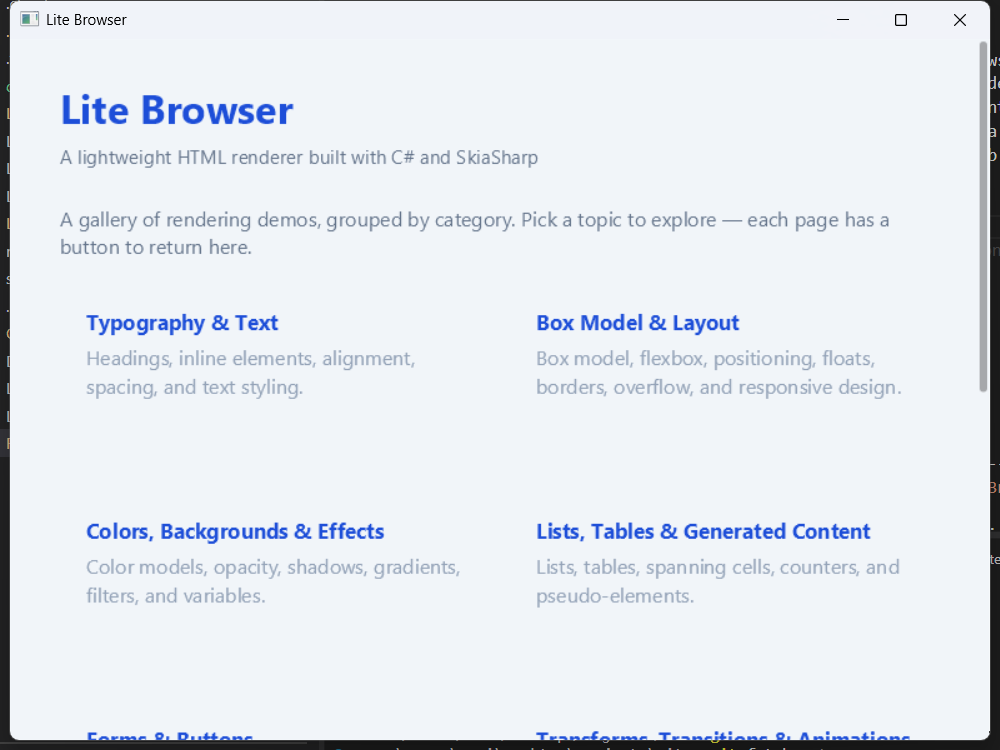

# Lite

Lite is an experimental HTML, CSS, and JavaScript rendering engine for Windows, written in C#. It turns a URL into a native Win32 window without embedding WebView2 or another browser engine.

HTML and CSS are parsed with AngleSharp, layout is calculated by Lite's own layout engine, pixels are drawn with SkiaSharp, and JavaScript runs in Jint. The project is intended for developers exploring browser internals, building constrained HTML-driven interfaces, or experimenting with a small managed rendering stack.

> Lite implements a practical subset of the web platform. It is not a replacement for a production browser, and arbitrary websites should not be expected to render exactly as they do in Chromium, Firefox, or Safari.



## Highlights

- Native Windows host and message loop with mouse, keyboard, scrolling, navigation, and page transitions
- Custom block, inline, flex, table, float, absolute, and fixed-position layout
- CSS cascade, selectors, media queries, custom properties, generated content, transforms, transitions, and keyframe animations
- DOM APIs, events, timers, promises, `fetch`, XMLHttpRequest, Web Storage, history, and ES modules
- Forms and common controls, including validation and submission
- Inline SVG, Canvas 2D, images, iframes, audio, and video
- Optional LibVLC media backend through `Lite.Media`
- Unit, Web Platform Test, CSS 2.1, Test262, and Acid test harnesses

## Requirements

- Windows
- .NET 8 SDK to build the repository
- An HTTP or HTTPS URL to render

Lite currently uses Win32 directly, so it is not cross-platform. Local pages should be served over HTTP; the example project includes a small static-file server for that purpose.

## Install

Add the package from NuGet:

```powershell
dotnet add package danisss9.Lite
```

During repository development, reference the project directly instead:

```xml
<ItemGroup>
  <ProjectReference Include="..\Lite\Lite.csproj" />
</ItemGroup>
```

## Create a window

```csharp
using Lite;

var window = new BrowserWindow(
    url: "https://example.com",
    title: "My Lite App",
    width: 1024,
    height: 768);

window.Run();
```

`BrowserWindow.Run()` loads the document, creates the native window, and enters the Win32 message loop. It blocks the calling thread until the window closes, so call it from the application's main UI thread.

The constructor is:

```csharp
BrowserWindow(
    string url,
    string title = "Lite",
    int width = 800,
    int height = 600)
```

## Run the example

The example hosts the files in `Lite.Example/resources` at `http://localhost:4444` and opens the gallery in Lite. Run it with `Lite.Example` as the working directory so its relative resources path resolves correctly:

```powershell
cd Lite.Example
dotnet run
```

The gallery contains focused pages for typography, layout, colors and effects, lists and tables, forms, transforms and animations, SVG and Canvas, JavaScript and DOM APIs, iframes, and media.

Real audio and video playback use LibVLC when its native Windows libraries are available. If initialization fails, the example falls back to Lite's simulated media timeline.

## How it works

| Area | Responsibility |
| --- | --- |
| `BrowserWindow` | Owns the native window, input dispatch, navigation, animation timer, and JavaScript event-loop pump |
| `Parser` | Downloads and parses documents, stylesheets, scripts, and modules into Lite's layout tree |
| `StyleResolver` | Resolves the cascade and reapplies styles after DOM mutations |
| `BoxEngine` | Calculates block, inline, flex, table, float, and positioned layouts |
| `Drawer` | Converts the layout tree into a SkiaSharp bitmap and hit regions |
| `JsEngine` | Hosts Jint and exposes the DOM, events, timers, networking, storage, and module APIs |
| `SvgRenderer` / `CanvasRenderer` | Paint inline SVG and Canvas 2D content |
| `Lite.Media` | Optionally connects HTML media elements to LibVLC |

The main rendering path is:

```text
URL -> resource loading -> HTML/CSS parsing -> style resolution
    -> layout tree -> box layout -> SkiaSharp painting -> Win32 window

JavaScript -> DOM mutation/event -> style and layout invalidation -> repaint
```

## Repository layout

| Project | Purpose |
| --- | --- |
| `Lite` | The NuGet library and rendering engine |
| `Lite.Media` | Optional LibVLC-backed media implementation |
| `Lite.Example` | Local static server and interactive rendering gallery |
| `Lite.Tests` | Dependency-free regression test executable |
| `Lite.Conformance` | CSS 2.1, WPT, Test262, Acid, and compatibility-profile runners |

## Development

Build the complete solution:

```powershell
dotnet build Lite.sln
```

Run the regression suite:

```powershell
dotnet run --project Lite.Tests/Lite.Tests.csproj -c Release
```

The upstream conformance suites are downloaded separately and pinned by `Lite.Conformance/test-suites.lock.json`:

```powershell
./scripts/fetch-tests.ps1

dotnet run --project Lite.Conformance -c Release -- --suite profile
dotnet run --project Lite.Conformance -c Release -- --suite css21
dotnet run --project Lite.Conformance -c Release -- --suite wpt
dotnet run --project Lite.Conformance -c Release -- --suite html53
dotnet run --project Lite.Conformance -c Release -- --suite test262
dotnet run --project Lite.Conformance -c Release -- --suite acid
```

Lite targets the [HTML 5.3 Working Draft of 18 October 2018](https://www.w3.org/TR/2018/WD-html53-20181018/), alongside the separate CSS 2.1 and ES2020 workstreams. The [active profile](Lite.Conformance/Profile/lite-html53-css21-es2020-profile.json) publishes its exclusions and incomplete coverage. Historical HTML 5.2 contracts remain in `Lite.Conformance/Profile/history/`.

Curated green tests protect existing behavior; they do not establish complete standards conformance. `--suite html53` runs the small set of reviewed assertions. `html53ProfileReady` remains false until all applicable requirements and required dependencies have current passing evidence. See [HTML 5.3 implementation and evidence](docs/html53-conformance.md) for the remaining work, upstream WPT serving, and report commands.

## Contributing

Bug reports and focused pull requests are welcome. For rendering fixes, include a minimal HTML/CSS/JS reproduction and add the smallest relevant regression test. Run the unit suite and the affected conformance suite before opening a pull request.

When changing rendering behavior, keep parsing, style resolution, layout, painting, hit testing, and DOM-driven invalidation in mind: a visual fix in one stage can expose a mismatch in another.

## License

Lite is available under the [MIT License](LICENSE).
